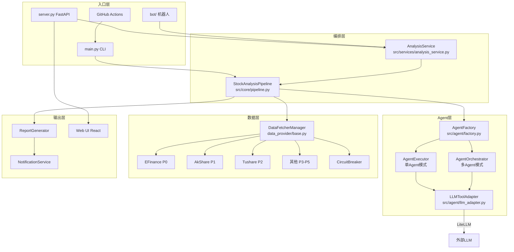
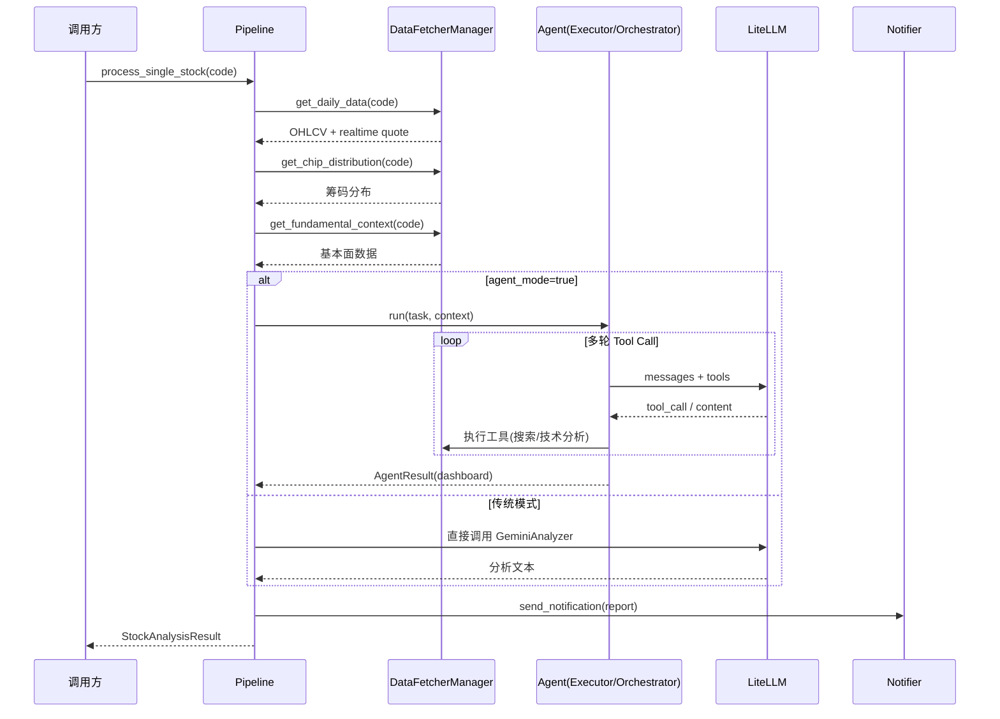
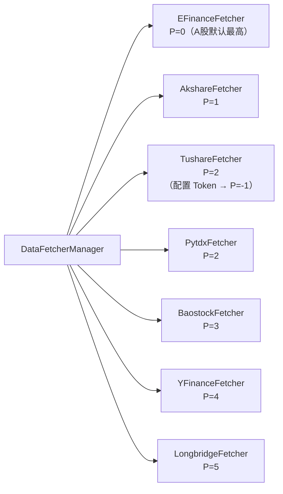
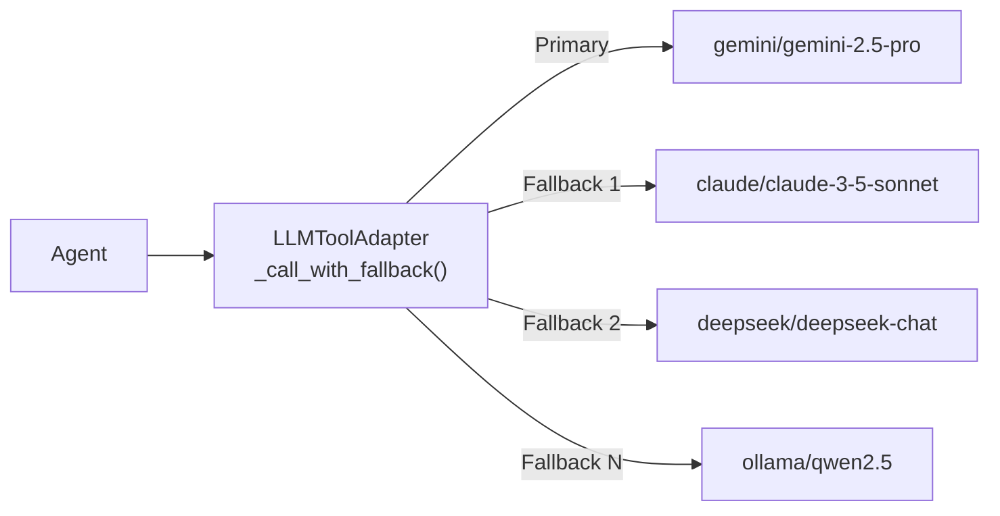
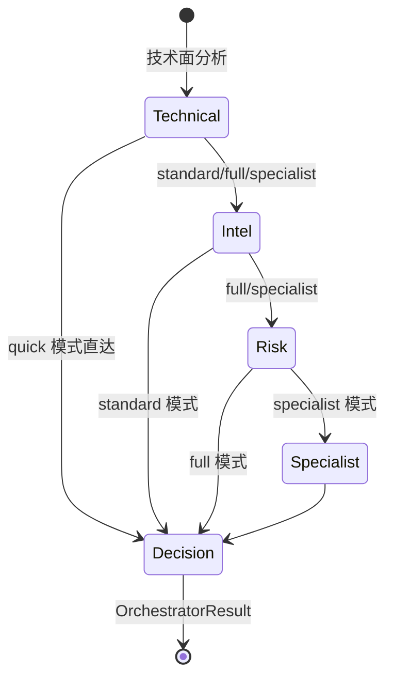
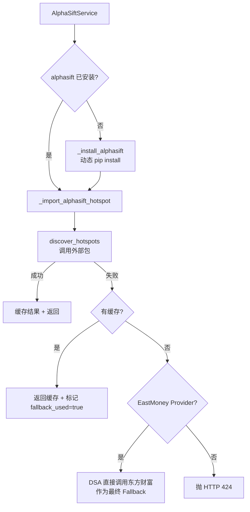

# daily_stock_analysis 高级开发者学习指南

> 适用读者：有 Python 工程经验、熟悉异步/并发、希望深入理解系统架构与扩展点的开发者。  
> 生成日期：2026-06-24 | 仓库：[ZhuLinsen/daily_stock_analysis](https://github.com/ZhuLinsen/daily_stock_analysis)

---

## 目录

1. [项目定位](#1-项目定位)
2. [整体架构](#2-整体架构)
3. [核心数据流](#3-核心数据流)
4. [核心模块拆解](#4-核心模块拆解)
5. [数据源与 Fallback 机制](#5-数据源与-fallback-机制)
6. [LLM 集成与 Prompt 设计](#6-llm-集成与-prompt-设计)
7. [Multi-Agent 架构](#7-multi-agent-架构)
8. [API 与 Web 前端](#8-api-与-web-前端)
9. [AlphaSift 选股集成](#9-alphasift-选股集成)
10. [配置系统深度解析](#10-配置系统深度解析)
11. [技术栈全景](#11-技术栈全景)
12. [设计原则与关键决策](#12-设计原则与关键决策)
13. [分阶段学习路径](#13-分阶段学习路径)
14. [源码阅读问题清单](#14-源码阅读问题清单)
15. [常见陷阱与误区](#15-常见陷阱与误区)
16. [参考资源](#16-参考资源)

---

## 1. 项目定位

**daily_stock_analysis** 是一个面向 A 股 / 港股 / 美股的 AI 驱动智能分析系统，核心价值主张：

- **全自动化**：从数据抓取、技术指标计算、新闻检索，到 LLM 分析、报告生成、多渠道通知，全链路无人值守。
- **决策仪表盘（Decision Dashboard）**：每次分析输出结构化 JSON，包含趋势判断、技术信号、风险评级、投资结论。
- **多模型/多数据源容错**：任意单点故障不应中断主流程，系统在数据层与 LLM 层均内置优先级 Fallback 与熔断。
- **可扩展 Skill 系统**：Agent 分析能力通过 Skill（策略插件）横向扩展，无需修改主流程。

---

## 2. 整体架构



**关键架构决策**：

- 入口层与编排层解耦 — CLI/API/Bot 均通过 `StockAnalysisPipeline` 或 `AnalysisService` 进入，没有重复的业务逻辑。
- Agent 架构通过 `AGENT_ARCH` 环境变量在 `single`（单 Agent）和 `multi`（多 Agent Orchestrator）之间切换，调用方接口不变。
- 数据层完全面向 `DataFetcherManager` 编程，上层代码不感知具体数据源。

---

## 3. 核心数据流



**Pipeline 内部步骤编号**（`src/core/pipeline.py`）：

| Step | 操作 | 关键点 |
|------|------|--------|
| 1 | 获取日线数据 + 实时行情 | 实时行情补充日线字段（量比等） |
| 2 | 获取筹码分布 | 熔断保护，失败不中断流程 |
| 2.5 | 基本面聚合 | 独立 timeout 预算，fail-open |
| 3 | 趋势分析（MA/技术指标） | 两条路径（Agent/传统）共用 |
| 4 | Agent 分析 or 传统 LLM 分析 | `agent_mode` 配置或有 Skill 时自动切换 |
| 5 | 报告生成 | 结构化 Dashboard JSON |
| 6 | 通知推送 | 单股分析时即时推送 |

---

## 4. 核心模块拆解

| 模块 | 路径 | 职责 | 依赖 | 阅读优先级 |
|------|------|------|------|-----------|
| **主流程编排** | `src/core/pipeline.py` | 单股分析全流程协调 | DataFetcherManager, Agent, Reporter | ★★★★★ |
| **Agent 工厂** | `src/agent/factory.py` | 根据配置构建 Executor 或 Orchestrator | LLMToolAdapter, ToolRegistry, SkillManager | ★★★★★ |
| **Multi-Agent Orchestrator** | `src/agent/orchestrator.py` | 多 Stage 流水线协调，超时/预算管理 | AgentContext, StageResult | ★★★★☆ |
| **LLM 适配器** | `src/agent/llm_adapter.py` | LiteLLM 统一调用，fallback 链，限速退避 | litellm | ★★★★☆ |
| **数据抓取管理** | `data_provider/base.py` | Fetcher 优先级调度，熔断，字段补充 | 各 Fetcher 实现 | ★★★★★ |
| **配置系统** | `src/config.py` | 全量配置 dataclass，环境变量解析 | — | ★★★★☆ |
| **AlphaSift 服务** | `src/services/alphasift_service.py` | 外部选股包集成，动态安装，热点/策略 | alphasift（可选包） | ★★★☆☆ |
| **分析服务** | `src/services/analysis_service.py` | API 层调用 Pipeline 的门面 | Pipeline, DiagnosticContext | ★★★☆☆ |
| **通知服务** | `src/services/notification_service.py` | 多渠道消息分发，渠道独立失败不级联 | 各渠道 adapter | ★★★☆☆ |
| **Skill 管理** | `src/agent/skill_manager.py` | Skill 加载、激活、权重管理 | SkillRegistry | ★★★☆☆ |
| **Tool Registry** | `src/agent/tools/registry.py` | Agent 工具注册与分发 | 各 Tool 实现 | ★★★☆☆ |
| **API 路由** | `api/` | FastAPI 端点，SSE 进度推送 | AnalysisService | ★★☆☆☆ |

---

## 5. 数据源与 Fallback 机制

### 5.1 Fetcher 优先级体系



**调度逻辑**（`data_provider/base.py`）：

1. 初始化时按 `priority` 升序排列 Fetchers。
2. 迭代尝试各 Fetcher，成功即返回，失败记录日志继续下一个。
3. 实时行情场景额外支持**字段补充策略**：主源缺少 `volume_ratio` 等字段时，从次源补充，不触发完整 Fallback。
4. 港股/美股优先走 `YFinanceFetcher` 或 `LongbridgeFetcher`，路由逻辑在 `DataFetcherManager` 按市场区分。

### 5.2 熔断器（CircuitBreaker）

实现于 `data_provider/realtime_types.py`：

```
实时行情熔断：failure_threshold=3，cooldown=300s
筹码分布熔断：failure_threshold=2，cooldown=600s
```

**核心接口**：
- `circuit_breaker.is_available(source_key)` — 判断数据源是否可用
- `circuit_breaker.record_failure(source_key, error)` — 记录失败，触发计数
- `circuit_breaker.record_success(source_key)` — 重置失败计数

**设计意图**：避免单次抖动拖慢整个分析流程；冷却后自动恢复，无需人工干预。

### 5.3 TickFlow 特殊路径

大盘指数/市场统计数据优先走 TickFlow（外部 API），失败时 fallback 到标准 Fetcher 链。`TICKFLOW_API_KEY` 未配置时完全跳过，不影响正常运行。

---

## 6. LLM 集成与 Prompt 设计

### 6.1 LiteLLM 统一网关

所有 LLM 调用经由 `LLMToolAdapter`（`src/agent/llm_adapter.py`）统一代理，底层使用 [LiteLLM](https://github.com/BerriAI/litellm)：



**Fallback 触发条件**（按序尝试）：

| 异常类型 | 行为 |
|---------|------|
| `RateLimitError` 且同 provider | 指数退避后重试 |
| `RateLimitError` 且跨 provider | 立即切换，不退避 |
| `ContextWindowExceededError` | 直接切换下一模型 |
| 其他异常 | 记录日志，切换下一模型 |

### 6.2 LLM 渠道路由（Channel Routing）

通过 `LITELLM_CHANNEL_CONFIG`（YAML）配置多套 LLM 渠道，不同任务类型（agent/market_review/backtesting）可路由到不同 provider/model，实现成本与能力的精细化分配。配置解析位于 `src/config.py` 约 L1250 处。

### 6.3 Trading Philosophy（交易理念嵌入）

系统将固定的交易理念规则（`docs/trading_philosophy_rules.md`）注入 Prompt，约束 LLM 输出：

- **趋势优先**：只做顺势交易，不抄底摸顶。
- **止损纪律**：必须给出明确的止损位。
- **仓位管理**：分批建仓原则。

这些规则通过 `skill_instructions` 传入 Agent，保证每次分析的决策框架一致性。

---

## 7. Multi-Agent 架构

### 7.1 两种 Agent 架构对比

| 特性 | Single（legacy） | Multi（Orchestrator） |
|------|------------------|-----------------------|
| 入口配置 | `AGENT_ARCH=single`（默认） | `AGENT_ARCH=multi` |
| 流程 | 单 Agent 多轮 Tool Call | 多专化 Agent 顺序流水线 |
| LLM 调用次数 | ~5-15 次/股 | ~3-8 次/股（结构化分工） |
| 超时控制 | 单次 timeout | 全流水线预算（`AGENT_ORCHESTRATOR_TIMEOUT_S`） |
| 适用场景 | 灵活问答、chat | 标准化批量分析 |

### 7.2 Orchestrator 流水线模式



**预算守卫机制**：
- 全流水线共享一个 `timeout_s` 预算（默认 600s）。
- 每个 Stage 启动前检查剩余预算 ≥ `_MIN_STAGE_BUDGET_S`（15s）。
- 预算不足时跳过剩余 Stage，基于已完成阶段自动降级生成 Dashboard，并标注 `"多 Agent 预算不足"` 提示。

### 7.3 AgentContext 共享状态

`AgentContext` 在整个流水线中传递，各 Stage Agent 通过 `ctx.set_data()` / `ctx.get_data()` 共享中间结果：

```
Technical Agent → ctx["technical_analysis"]
Intel Agent     → ctx["market_intel"]  
Risk Agent      → ctx["risk_assessment"]
Decision Agent  → ctx["final_dashboard"]
```

### 7.4 Skill 系统

Skill 是可插拔的分析策略，通过 `AGENT_SKILLS` 配置激活：

- **加载**：`SkillManager` 从 `AGENT_SKILL_DIR` 扫描 Markdown/YAML 格式的 Skill 文件。
- **注入**：Skill 内容编译为 `skill_instructions` 字符串，附加到 System Prompt。
- **自动权重**：`AGENT_SKILL_AUTOWEIGHT=true` 时，根据回测表现动态调整 Skill 优先级。
- **特殊保护**：`technical_skill_policy` 单独管理技术面 Skill，防止被过度覆盖。

---

## 8. API 与 Web 前端

### 8.1 FastAPI 端点结构

```
api/
├── analysis.py      — /api/analysis/* 单股分析、历史查询
├── agent.py         — /api/agent/* Agent 对话、chat
├── alphasift.py     — /api/alphasift/* 选股热点、策略
├── market.py        — /api/market/* 大盘数据
├── portfolio.py     — /api/portfolio/* 组合分析
└── diagnostics.py   — /api/diagnostics/* 诊断数据
```

**SSE 进度推送**：分析任务通过 Server-Sent Events 实时推送进度百分比，前端 React 订阅 `/api/analysis/stream/{task_id}`。

### 8.2 Web 前端（apps/dsa-web）

技术栈：React + TypeScript + Vite，主要页面：

- **Dashboard**：实时分析结果展示，含 K 线图、决策仪表盘。
- **AI 分析页**：Agent 对话界面，支持多轮问答。
- **AlphaSift 页**：选股热点、策略扫描结果。
- **历史记录**：分析历史查询与对比。

---

## 9. AlphaSift 选股集成

AlphaSift 是一个**可选的外部 Python 包**，通过动态安装与适配器模式集成：



**核心设计点**（`src/services/alphasift_service.py`）：

1. **动态安装**：通过 `ALPHASIFT_INSTALL_SPEC` 配置安装源，生产环境可指向私有 PyPI。
2. **运行时上下文隔离**：`_alphasift_runtime_env(config)` context manager 在调用外部包时注入必要的环境变量。
3. **三层降级**：live → cache → DSA 直接采集（仅 EastMoney provider）。
4. **瘦行检测**：`_hotspot_rows_are_thin()` 判断 AlphaSift 返回行数不足时触发 DSA 直接 Fallback。
5. **热点详情懒加载**：`include_details=True` 时才触发详情聚合，避免不必要的 API 调用。

---

## 10. 配置系统深度解析

配置系统以 `@dataclass` 实现（`src/config.py`），通过 `get_config()` 全局单例获取。

### 10.1 关键配置分组

| 分组 | 关键字段 | 说明 |
|------|---------|------|
| LLM | `LITELLM_MODEL`, `LITELLM_FALLBACK_MODELS` | 主模型 + fallback 链，逗号分隔 |
| Agent | `AGENT_MODE`, `AGENT_ARCH`, `AGENT_ORCHESTRATOR_MODE` | 分析模式选择 |
| Agent 能力 | `AGENT_SKILLS`, `AGENT_MAX_STEPS` | Skill 激活与步数上限 |
| 数据 | `ENABLE_REALTIME_QUOTE`, `TUSHARE_TOKEN` | 实时行情与数据源配置 |
| AlphaSift | `ALPHASIFT_ENABLED`, `ALPHASIFT_INSTALL_SPEC` | 选股集成开关 |
| 通知 | `TELEGRAM_BOT_TOKEN`, `FEISHU_WEBHOOK` 等 | 各渠道独立配置 |
| 调度 | `ANALYSIS_TIME`, `SCHEDULE_STOCKS` | 定时分析设置 |

### 10.2 配置优先级

```
环境变量 > .env 文件 > dataclass 默认值
```

**重要**：`.env` 文件不由应用自动加载（需要 `python-dotenv` 手动加载），Docker/Actions 通过环境变量注入。

### 10.3 Config Registry（`src/core/config_registry.py`）

运行时动态配置覆盖机制，允许在不重启服务的情况下修改部分配置（如 `report_language`），用于 API 层对单次请求的配置隔离。

---

## 11. 技术栈全景

| 技术 | 角色 | 位置 | 选型理由 |
|------|------|------|---------|
| **Python 3.10+** | 主体语言 | 全部后端 | dataclass 增强、match 语法 |
| **FastAPI** | API 服务 | `server.py`, `api/` | 异步支持、SSE、自动文档 |
| **LiteLLM** | LLM 统一网关 | `src/agent/llm_adapter.py` | 多 provider 统一接口、自动 fallback |
| **EFinance/AkShare** | A股数据主力 | `data_provider/` | 免费、无需 Token、稳定性好 |
| **React + TypeScript** | Web 前端 | `apps/dsa-web/` | 组件化、类型安全 |
| **Electron** | 桌面端 | `apps/dsa-desktop/` | 跨平台桌面包装 Web 产物 |
| **SQLite** | 本地数据存储 | `src/repositories/` | 轻量、无部署依赖 |
| **pytest** | 测试框架 | `tests/` | 单元 + 集成测试 |
| **Docker Compose** | 容器化部署 | `docker/` | 生产部署标准方式 |
| **GitHub Actions** | CI/CD + 定时分析 | `.github/workflows/` | 免服务器每日自动运行 |

---

## 12. 设计原则与关键决策

### Fail-Open 而非 Fail-Fast

系统**强制要求**单点失败不中断主流程：
- 基本面数据获取失败 → 返回 `failed` 状态结构体，Pipeline 继续。
- 筹码分布失败 → `chip_data=None`，报告标注缺失。
- 通知渠道失败 → 仅记录日志，不抛异常。
- AlphaSift 失败 → 降级到缓存或 DSA 直接采集。

**例外**：数据完全无法获取时（所有 Fetcher 均失败），Pipeline 才中止该股分析。

### Agent 架构的向后兼容

`AgentOrchestrator` 暴露与 `AgentExecutor` 完全相同的 `run()` / `chat()` 接口，Factory 在两者之间透明切换。上层调用方（`Pipeline`, `AnalysisService`, `API`）无需感知架构差异。

### 配置驱动而非硬编码

- Agent 模式切换：环境变量 `AGENT_ARCH`，不改代码。
- Skill 激活：`AGENT_SKILLS=strategy,risk`，不改代码。
- LLM provider 切换：`LITELLM_MODEL=claude/claude-3-7-sonnet-latest`，不改代码。
- 不配置即可运行：所有扩展能力（AlphaSift、TickFlow、实时行情、Tushare）均为 opt-in，缺少配置时静默降级。

### 诊断上下文（DiagnosticContext）

通过 `activate_run_diagnostic_context()` / `reset_run_diagnostic_context()` 线程本地存储绑定 `trace_id`、`query_id`，使日志可按分析任务聚合，便于定位跨模块问题。

---

## 13. 分阶段学习路径

### Stage 1：理解全流程（建议 0.5 天）

**目标**：能在脑子里走通一次完整的单股分析。

1. 读 `README.md` 了解系统边界。
2. 读 `src/config.py` 前 200 行，理解配置结构。
3. 跑 `python main.py --stocks 600519 --dry-run`，观察日志输出各步骤。
4. 读 `src/core/pipeline.py` 的 `process_single_stock()` 方法，对照日志确认每个 Step。

### Stage 2：数据层（建议 0.5 天）

**目标**：理解多数据源调度与熔断机制。

1. 读 `data_provider/base.py` — `DataFetcherManager` 的初始化与 `get_daily_data()` 实现。
2. 读 `data_provider/realtime_types.py` — `CircuitBreaker` 状态机。
3. 读 `data_provider/efinance_fetcher.py` — 最高优先级 Fetcher 实现，理解字段标准化。
4. 运行 `tests/test_chip_distribution_manager.py` 与 `tests/test_tickflow_market_review_fallback.py`，通过测试理解 fallback 路径。

### Stage 3：LLM 与 Agent 单模式（建议 1 天）

**目标**：理解 Agent 在单模式下如何执行工具调用并输出 Dashboard。

1. 读 `src/agent/llm_adapter.py` — `_call_with_fallback()` 方法，理解多模型 fallback 逻辑。
2. 读 `src/agent/factory.py` — `build_agent_executor()` 与 `resolve_skill_prompt_state()`。
3. 读 `src/agent/executor.py` — 单 Agent 的 `run()` 主循环，Tool Call → 结果 → 再调用。
4. 读 `src/agent/tools/registry.py` — 工具注册机制，找一个具体 Tool 实现（如搜索工具）读完。
5. 配置 `AGENT_MODE=true` + 真实 LLM Key，跑一次单股分析，观察 tool_calls_log。

### Stage 4：Multi-Agent Orchestrator（建议 0.5 天）

**目标**：理解多 Agent 流水线的编排与超时机制。

1. 读 `src/agent/orchestrator.py` — `_execute_pipeline()` 与 `_build_agent_chain()`。
2. 理解 `_MIN_STAGE_BUDGET_S` 预算守卫逻辑。
3. 理解 `AgentContext` 共享状态如何在 Stage 间传递。
4. 设置 `AGENT_ARCH=multi`，观察日志中各 Stage 的执行时序。

### Stage 5：AlphaSift 与扩展点（建议 0.5 天）

**目标**：理解外部包集成模式与三层降级。

1. 读 `src/services/alphasift_service.py` — `AlphaSiftService.hotspots()` 完整方法。
2. 理解 `_alphasift_runtime_env` context manager 的隔离机制。
3. 读 `api/alphasift.py` 了解 API 暴露方式。
4. 思考：如何为其他外部数据包实现同样的动态安装 + 三层降级模式？

---

## 14. 源码阅读问题清单

读完源码后，建议用以下问题验证理解深度：

**数据层**
1. 当 EFinanceFetcher 失败且 AkshareFetcher 超时，系统会记录几次熔断失败？熔断触发后下一次请求什么时候才会重新尝试？
2. 实时行情的"字段补充策略"与完整 Fallback 的触发条件有何区别？为什么要区分？
3. `TUSHARE_TOKEN` 配置后优先级变为 -1 的实现位于哪里？这会影响 HK/US 股票的数据路由吗？

**LLM 层**
4. 当主模型触发 RateLimitError 而 fallback 模型是同一 provider 时，退避时间如何计算？
5. `LITELLM_CHANNEL_CONFIG` 如何实现不同任务类型路由到不同 LLM？Channel 匹配逻辑在哪里？
6. ContextWindowExceededError 时直接切换模型而不是截断输入，这个设计取舍是什么？

**Agent 层**
7. `AgentOrchestrator` 与 `AgentExecutor` 的 `run()` 接口相同，但内部 `AgentResult` 的 `total_steps` 含义是否一致？
8. Skill 的 `autoweight` 功能基于什么数据来源？权重数据存在哪里？
9. `agent_risk_override=true` 时，Risk Agent 否决买入信号的机制是什么？体现在 `AgentContext` 的哪个字段？

**扩展点**
10. 如果要新增一个数据源 Fetcher，需要实现哪些接口？继承哪个基类？在哪里注册？
11. 如果要新增一个 Agent Tool，需要在哪些文件做改动？
12. AlphaSift 的 `_alphasift_runtime_env` 注入了哪些环境变量？为什么需要隔离而不是全局设置？

---

## 15. 常见陷阱与误区

**误区 1：认为 `agent_mode=false` 时不调用 LLM**
→ 错。传统模式下仍通过 `GeminiAnalyzer` 直接调用 LLM，只是不走 Agent Tool Call 框架。

**误区 2：认为配置了 `AGENT_SKILLS` 就会自动启用 Agent 模式**
→ 部分正确。Pipeline 中有逻辑在检测到非空 `analysis_skills` 或 `configured_skills != ['all']` 时自动切换，但前提是 `agent_skills` 不为 `['all']`，具体见 `pipeline.py` Step 4 分支。

**误区 3：直接读 `config.agent_mode` 判断是否走 Agent 路径**
→ Pipeline 中使用 `getattr(self.config, 'agent_mode', False)` 而非直接属性访问，同时还检查 `analysis_skills`，两者任一为真都会走 Agent 路径。

**误区 4：认为 Multi-Agent 模式一定比 Single 模式慢**
→ Multi 模式通过结构化分工减少单 Agent 的无效工具调用，`quick` 子模式（Technical → Decision）实际更快。

**误区 5：认为 AlphaSift 是系统核心依赖**
→ AlphaSift 完全可选，`ALPHASIFT_ENABLED=false`（默认）时所有相关 API 返回 `enabled: false`，主流程不受影响。

**误区 6：修改通知渠道配置后认为不需要重启**
→ 配置在启动时解析为 dataclass，运行时变更无效，必须重启服务。`Config Registry` 只覆盖少数字段。

---

## 16. 参考资源

| 资源 | 说明 |
|------|------|
| `docs/full-guide.md` | 项目完整部署与使用指南（中文） |
| `docs/full-guide_EN.md` | 英文版完整指南 |
| `docs/CHANGELOG.md` | 版本变更记录，了解近期架构演进 |
| `.env.example` | 所有可配置环境变量完整列表 |
| `tests/` | 单元 + 集成测试，最好的"活文档" |
| [LiteLLM 文档](https://docs.litellm.ai/) | LLM 调用层依赖文档 |
| [DeepWiki: ZhuLinsen/daily_stock_analysis](https://deepwiki.com/ZhuLinsen/daily_stock_analysis) | AI 生成的完整 Wiki，含详细模块说明 |
| `AGENTS.md` / `CLAUDE.md` | AI 协作规则，PR 流程规范 |

---

*本指南基于 2026-06-24 代码快照生成，架构演进后请以实际代码为准。*
