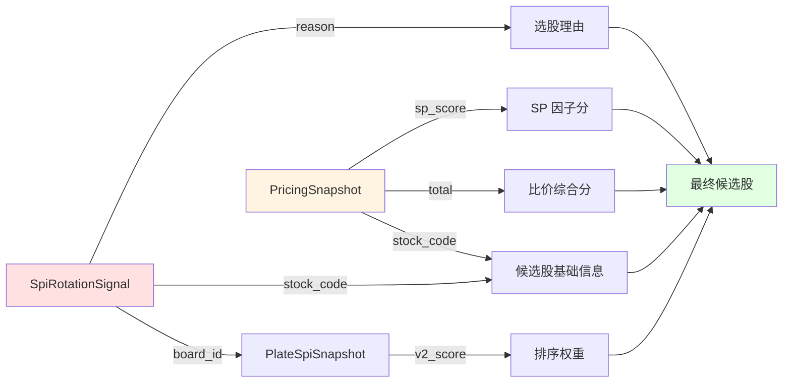
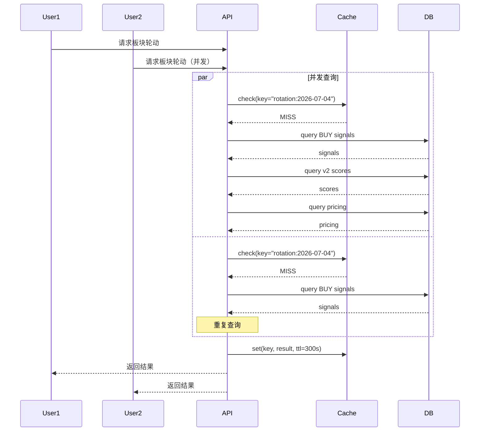
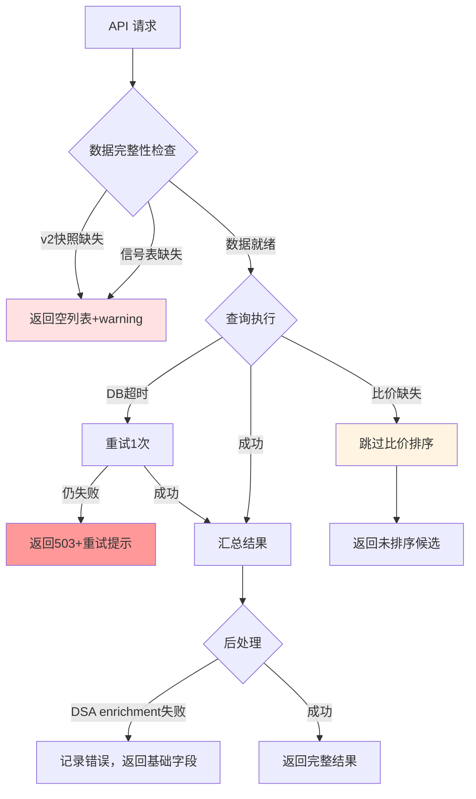
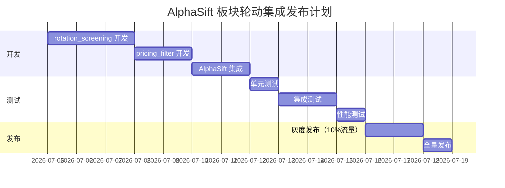

# AlphaSift 板块轮动集成技术细节

> **版本**: v1.1  
> **日期**: 2026-07-04  
> **配套文档**: `alphasift-spi-integration.md`
> 
> **实现状态**：
> - ✅ **Phase3 比价系统**：当前使用 **SP + CMF + Flow** 三因子（非 RS）
> - ✅ **数据层查询接口**：`PricingRepository.find_board_pricing_rank()` 已落地
> - ✅ **AlphaSift 集成层**：`SectorRotationScreener` / `PricingFilter` 已落地

---

## 1. 数据模型与字段映射

### 1.1 轮动信号 → 候选股映射



### 1.2 候选股 Schema 扩展

**原有 AlphaSift 候选股字段**：

```python
{
  "code": "600519",
  "name": "贵州茅台",
  "price": 1680.00,
  "change_pct": 2.5,
  # ... DSA enrichment 字段
}
```

**新增字段（板块轮动策略）**：

```python
{
  # 原有字段 +
  "board_id": 801010,                    # 所属板块 ID
  "board_name": "食品饮料",               # 板块名称
  "board_v2_score": 85.3,                # 板块 SPI v2 评分
  "total": 0.78,                         # 比价综合分 [0,1]（SP+CMF+Flow 加权）
  "pricing_rank": 1,                     # 板块内比价排名（集成层计算）
  "sp_ratio": 0.85,                      # 市值盈利比价（原始值）
  "sp_score": 0.54,                      # SP 归一化分 [0,1]
  "cmf": 0.15,                           # CMF 原始值 [-1,1]（未归一化）
  "flow_score": 0.65,                    # 资金流分 [0,1]（可选）
  "status": "ok",                        # ok | degraded | missing_core_factor
  "factor_mask": "sp,cmf,flow",          # 参与计算的因子
  "selection_reason": "板块轮动BUY信号"   # 选股理由
}
```

**字段说明**：
- `total`：主排序字段，范围 [0, 1]，由 `0.6*sp_score + 0.3*cmf_normalized + 0.1*flow_score` 计算
- `sp_ratio`：原始值，无上下界限。`sp_ratio > 1` 表示估值相对板块偏高
- `sp_score`：经过 `1/(1+sp_ratio)` 转换，范围 [0, 1]
- `cmf`：原始值范围 [-1, 1]，评分时会归一化到 [0, 1]
- `rs_score`：保留诊断字段（不展示），不参与主评分
- `pricing_rank`：由集成层按 `total DESC` 计算，PricingSnapshot 表无此字段

---

## 2. 核心算法伪代码

### 2.1 板块轮动选股算法

```
FUNCTION screen_sector_rotation(market, max_results, trade_date):
    # 阶段1：获取轮动信号
    buy_signals = DB.query(
        SpiRotationSignal
        WHERE trade_date = trade_date
          AND action = 'BUY'
    )
    
    IF buy_signals IS EMPTY:
        RETURN empty_result_with_warning("无BUY信号")
    
    # 阶段2：按板块分组
    board_stocks = GROUP_BY(buy_signals, key=board_id)
    # 结果: {801010: ["600519", "000858"], 801020: [...]}
    
    # 阶段3：获取板块评分
    board_ids = KEYS(board_stocks)
    board_scores = DB.query(
        PlateSpiSnapshot
        WHERE trade_date = trade_date
          AND board_id IN board_ids
          AND v2_score IS NOT NULL
        ORDER BY v2_score DESC
    )
    
    # 阶段4：板块内选股（按比价分）
    candidates = []
    FOR EACH board_id, stock_codes IN board_stocks:
        # 获取板块内比价快照（调用 Repository 层）
        pricing_rows = PricingRepository.find_board_pricing_rank(
            board_id=board_id,
            trade_date=trade_date
        )
        
        # 过滤出轮动信号涉及的个股
        filtered = [r FOR r IN pricing_rows IF r.stock_code IN stock_codes]
        
        # 按 total DESC 排序，取前5
        top_stocks = SORT(filtered, key=total, reverse=True)[0:5]
        
        FOR EACH stock IN top_stocks:
            candidates.APPEND({
                code: stock.stock_code,
                board_id: board_id,
                board_name: board_scores[board_id].board_name,
                board_v2_score: board_scores[board_id].v2_score,
                total: stock.total,
                sp_ratio: stock.sp_ratio,
                sp_score: stock.sp_score,
                cmf: stock.cmf,
                flow_score: stock.flow_score,
                status: stock.status,
                reason: f"板块轮动BUY信号（板块v2={v2_score}）"
            })
    
    # 阶段5：按板块 v2 评分全局排序
    candidates.SORT(key=board_v2_score, reverse=True)
    
    RETURN {
        candidates: candidates[0:max_results],
        rotation_boards: COUNT(board_stocks),
        trade_date: trade_date
    }
```

### 2.2 比价过滤算法

```
FUNCTION apply_pricing_filter(candidates, min_score=0.5, trade_date):
    # 阶段1：按板块分组
    board_groups = GROUP_BY(candidates, key=board_id)
    
    enriched = []
    FOR EACH board_id, group IN board_groups:
        # 阶段2：获取该板块比价快照
        pricing_rows = PricingRepository.find_board_pricing_rank(
            board_id=board_id,
            trade_date=trade_date
        )
        
        # 按 total DESC 排序并计算排名
        sorted_rows = SORT(pricing_rows, key=total, reverse=True)
        pricing_map = {}
        FOR idx, row IN ENUMERATE(sorted_rows):
            pricing_map[row.stock_code] = {
                total: row.total,
                rank: idx + 1,
                sp_ratio: row.sp_ratio,
                sp_score: row.sp_score,
                cmf: row.cmf,
                flow_score: row.flow_score,
                status: row.status
            }
        
        # 阶段3：匹配并过滤
        FOR EACH candidate IN group:
            pricing = pricing_map.GET(candidate.code)
            
            IF pricing EXISTS:
                candidate.total = pricing.total
                candidate.pricing_rank = pricing.rank
                candidate.sp_ratio = pricing.sp_ratio
                candidate.sp_score = pricing.sp_score
                candidate.cmf = pricing.cmf
                candidate.flow_score = pricing.flow_score
                
                # 过滤低分股
                IF pricing.total IS NOT NULL AND pricing.total < min_score:
                    CONTINUE  # 跳过
            ELSE:
                candidate.total = NULL
            
            enriched.APPEND(candidate)
    
    # 阶段4：可选重排序
    enriched.SORT(
        key=(total DESC),
        nulls_last=True
    )
    
    RETURN enriched
```

### 2.3 策略路由决策树

```
FUNCTION route_strategy(strategy, market, max_results, filters):
    IF strategy == "sector_rotation":
        # 路径1：板块轮动独立策略
        RETURN screen_sector_rotation(market, max_results)
    
    ELSE:
        # 路径2：原有 AlphaSift 策略
        raw_candidates = alphasift_adapter.screen(strategy, market, max_results)
        candidates = normalize_candidates(raw_candidates)
        
        # 可选：叠加比价过滤（对具备 board_id/code 的候选股生效）
        IF filters.enable_pricing_filter == TRUE:
            candidates = apply_pricing_filter(candidates)
        
        RETURN candidates
```

---

## 3. 数据库查询优化

### 3.1 关键索引

```sql
-- 轮动信号表
CREATE INDEX idx_rotation_signal_date_action 
ON spi_rotation_signal(trade_date, action);

CREATE INDEX idx_rotation_signal_board_date 
ON spi_rotation_signal(board_id, trade_date);

-- 比价快照表
CREATE INDEX idx_pricing_board_date 
ON pricing_snapshot(board_id, trade_date);

CREATE INDEX idx_pricing_code_date 
ON pricing_snapshot(stock_code, trade_date);

-- SPI v2 快照表
CREATE INDEX idx_spi_v2_date_score 
ON plate_spi_snapshot(trade_date, v2_score DESC) 
WHERE v2_score IS NOT NULL;
```

### 3.2 查询性能估算

| 查询场景 | 表扫描行数 | 索引使用 | 预估耗时 |
|---------|-----------|---------|---------|
| 获取当日 BUY 信号（约50条） | 50 | `idx_rotation_signal_date_action` | < 5ms |
| 获取板块 v2 评分（31个板块） | 31 | `idx_spi_v2_date_score` | < 3ms |
| 获取单板块比价排名（约30只股） | 30 | `idx_pricing_board_date` | < 5ms |
| **总计（5个板块）** | **~200** | **多索引组合** | **< 50ms** |

---

## 4. 并发与缓存策略

### 4.1 并发控制



### 4.2 缓存策略

```python
CACHE_STRATEGY = {
    "rotation_signals": {
        "key_pattern": "rotation:signals:{date}:{action}",
        "ttl": 300,  # 5分钟
        "invalidate_on": ["daily_refresh"]
    },
    "board_v2_scores": {
        "key_pattern": "spi:v2:{date}:top{n}",
        "ttl": 600,  # 10分钟
        "invalidate_on": ["daily_refresh"]
    },
    "pricing_ranks": {
        "key_pattern": "pricing:{board_id}:{date}",
        "ttl": 300,  # 5分钟
        "invalidate_on": ["daily_refresh", "manual_recalc"]
    }
}
```

---

## 5. 错误处理与降级

### 5.1 异常分类与处理



### 5.2 降级决策矩阵

| 故障点 | 检测条件 | 降级策略 | 用户体验 |
|--------|---------|---------|---------|
| **SPI v2 缺失** | `find_top_boards_v2()` 返回空 | 返回 `{candidates: [], warnings: ["v2数据未就绪"]}` | 友好提示 |
| **轮动信号缺失** | `find_rotation_signals()` 返回空 | 返回 `{candidates: [], warnings: ["无BUY信号"]}` | 友好提示 |
| **比价快照缺失** | `rank_stocks_in_board()` 返回空 | 跳过比价排序，返回 `pricing_score: null` | 降级但不阻断 |
| **成分股快照缺失** | `ConstituentSnapshot` 查询为空 | fallback 到 `legulegu.current_snapshot` | 当日可用，历史有偏差 |
| **DB 查询超时** | `OperationalError` / `timeout` | 重试1次 → 返回503 | 提示稍后重试 |

---

## 6. 性能基准与压测

### 6.1 延迟基准

| 场景 | P50 | P95 | P99 | 备注 |
|------|-----|-----|-----|------|
| 板块轮动选股（无缓存） | 80ms | 150ms | 250ms | 包含5个板块比价查询 |
| 板块轮动选股（有缓存） | 20ms | 40ms | 80ms | 命中信号+v2缓存 |
| 比价过滤（单板块） | 15ms | 30ms | 50ms | 约30只股查询 |
| DSA enrichment | 50ms | 100ms | 200ms | 复用现有逻辑 |

### 6.2 吞吐量估算

```
假设：
- 单实例 4核 8GB
- DB 连接池 20
- 无缓存命中率 50%

计算：
- 单请求平均延迟（含缓存）= (80ms * 0.5) + (20ms * 0.5) = 50ms
- 单核理论 QPS = 1000ms / 50ms = 20 QPS
- 4核并发 QPS ≈ 20 * 4 * 0.7（并发效率） ≈ 56 QPS

瓶颈：
- DB 查询延迟（主要）
- DSA enrichment（次要）

优化方向：
- 增加缓存覆盖率 → 目标80%命中
- 预加载热点板块比价数据
```

---

## 7. 兼容性与迁移

### 7.1 向后兼容

```python
# 老版本 API 调用（不传新参数）
POST /api/v1/alphasift/screen
{
  "strategy": "momentum",
  "market": "cn",
  "max_results": 20
}

# 行为：
# - 不触发板块轮动逻辑
# - 不启用比价过滤
# - 返回字段完全兼容旧版

# 新版本 API 调用（传新参数）
POST /api/v1/alphasift/screen
{
  "strategy": "momentum",
  "market": "cn",
  "max_results": 20,
  "enable_pricing_filter": true  # 新增参数
}

# 行为：
# - 沿用现有策略逻辑
# - 叠加比价过滤
# - 新增字段向后兼容（老客户端忽略）
```

### 7.2 数据迁移（无需）

- **SPI 表**：已有（阶段1/2）
- **轮动信号表**：已有（阶段2）
- **比价快照表**：已有（阶段3）
- **AlphaSift 表**：无改动

---

## 8. 监控埋点

### 8.1 关键指标埋点

```python
# 在 SectorRotationScreener.screen() 中埋点
metrics.counter("alphasift.strategy.sector_rotation.calls")
metrics.histogram("alphasift.strategy.sector_rotation.latency", duration_ms)
metrics.gauge("alphasift.strategy.sector_rotation.candidates", len(candidates))
metrics.gauge("alphasift.strategy.sector_rotation.rotation_boards", rotation_boards)

# 在 PricingFilter.apply() 中埋点
metrics.counter("alphasift.filter.pricing.calls")
metrics.histogram("alphasift.filter.pricing.filter_ratio", filtered_count / total_count)
metrics.gauge("alphasift.filter.pricing.enriched", len(enriched))

# 日终任务埋点
metrics.gauge("spi.rotation.buy_signals", buy_signal_count)
metrics.gauge("spi.rotation.sell_signals", sell_signal_count)
metrics.gauge("spi.pricing.snapshot_coverage", coverage_ratio)
```

### 8.2 告警规则

```yaml
alerts:
  - name: rotation_no_signals
    expr: spi.rotation.buy_signals == 0 AND hour() > 16
    severity: warning
    message: "当日无板块轮动 BUY 信号"
  
  - name: pricing_low_coverage
    expr: spi.pricing.snapshot_coverage < 0.8
    severity: warning
    message: "比价快照覆盖率低于80%"
  
  - name: sector_rotation_high_error_rate
    expr: rate(alphasift.strategy.sector_rotation.errors[5m]) > 0.1
    severity: critical
    message: "板块轮动策略错误率 > 10%"
```

---

## 9. 测试策略

### 9.1 单元测试覆盖

```
src/services/spi/rotation_screening.py
├── test_screen_no_signals          # 无信号场景
├── test_screen_with_signals        # 有信号场景
├── test_screen_with_pricing        # 启用比价排序
├── test_screen_without_pricing     # 禁用比价排序
├── test_board_grouping             # 板块分组逻辑
└── test_v2_score_sorting           # v2评分排序

src/services/spi/pricing_filter.py
├── test_apply_filter_basic         # 基础过滤
├── test_apply_filter_threshold     # 阈值过滤
├── test_apply_missing_pricing      # 比价缺失场景
└── test_apply_reordering           # 重排序逻辑

src/services/alphasift_service.py
├── test_route_sector_rotation      # 策略路由
├── test_route_with_pricing_filter  # 比价过滤路由
└── test_list_strategies_builtin    # 策略列表包含内置策略
```

### 9.2 集成测试场景

| 场景 | 前置数据 | 预期结果 |
|------|---------|---------|
| **场景1：完整数据** | v2快照 + BUY信号 + 比价快照 | 返回20只候选股，按v2降序 |
| **场景2：无信号** | v2快照，但无BUY信号 | 返回空列表 + warning |
| **场景3：比价缺失** | v2快照 + BUY信号，但比价表空 | 返回候选股，`pricing_score=null` |
| **场景4：跨日查询** | 查询历史日期 | 使用历史快照（point-in-time） |
| **场景5：并发请求** | 2个用户同时请求 | 缓存命中，无重复查询 |

---

## 10. 发布计划

### 10.1 分阶段发布



### 10.2 灰度发布策略

```python
# 通过配置控制灰度比例
FEATURE_FLAGS = {
    "sector_rotation_enabled": {
        "rollout_percentage": 10,  # 初始10%
        "whitelist_users": ["test_user_1"],
        "blacklist_strategies": []
    },
    "pricing_filter_enabled": {
        "rollout_percentage": 10,
        "whitelist_users": ["test_user_1"],
        "default_enabled": False
    }
}

# 发布节奏
# Day 1-2: 10% 流量，监控错误率
# Day 3-4: 50% 流量，监控性能
# Day 5:   100% 流量，正式上线
```

---

## 11. 故障排查手册

### 11.1 常见问题

| 问题 | 症状 | 排查步骤 |
|------|------|---------|
| **无候选股返回** | `candidates: []` | 1. 检查轮动信号表是否有数据<br>2. 检查 v2 快照是否就绪<br>3. 查看 warnings 字段 |
| **比价分为 null** | `pricing_score: null` | 1. 检查比价快照表是否有数据<br>2. 检查成分股快照是否覆盖<br>3. 确认日终任务是否成功 |
| **响应超时** | 503 / timeout | 1. 检查 DB 连接池是否耗尽<br>2. 查看慢查询日志<br>3. 检查缓存命中率 |

### 11.2 日志关键字

```bash
# 排查轮动信号生成失败
grep "轮动信号生成" /var/log/dsa/main.log

# 排查比价快照刷新失败
grep "比价快照" /var/log/dsa/main.log

# 排查 API 错误
grep "sector_rotation_failed" /var/log/dsa/api.log

# 排查性能问题
grep "alphasift.strategy.sector_rotation.latency" /var/log/dsa/metrics.log | awk '{print $NF}' | sort -n
```

---

## 12. FAQ

**Q1: 板块轮动策略与现有策略有什么区别？**

A: 板块轮动基于 SPI v2 评分 + 轮动信号（技术面），现有策略可能基于基本面、估值、动量等。两者可互补。

**Q2: 比价过滤会影响现有策略的结果吗？**

A: 只有显式传入 `enable_pricing_filter=true` 时才启用，默认不影响。

**Q3: 历史数据能回测板块轮动策略吗？**

A: 可以，但需要确保历史日期的轮动信号和比价快照已生成。当前实现对历史日期无成分股快照时**不允许 fallback**，只能用已有快照日期回测。建议从阶段2上线日开始。

**Q4: 如何处理板块间个股重叠？**

A: 当前策略允许重叠（一只股可能同时出现在多个板块的 BUY 信号中）。如需去重，在最终汇总时按 `code` 去重。

**Q5: 比价分的权重可以调整吗？**

A: 可以。权重在 `PricingService` 中配置（SP/CMF/Flow 默认 0.6/0.3/0.1），可通过常量调整。注意当 Flow 覆盖率低于 60% 时，会降级为 SP/CMF 双因子（权重 2/3 和 1/3）。

**Q6: 为什么使用 SP 而非 RS 作为主因子？**

A: SP（市值盈利比价）能更直接反映估值相对高低，而 RS（相对强弱）更偏重技术面动量。Phase3 验证后选择 SP 作为主因子（60% 权重），RS 保留为诊断字段。

**Q7: `cmf` 字段为什么不归一化？**

A: API 返回的是 CMF 原始值 [-1, 1]，保留完整信息供调用方分析。评分计算时会内部归一化到 [0, 1]。

**Q8: `pricing_rank` 为什么不在数据库表中？**

A: 排名是派生字段，由集成层按 `total DESC` 实时计算。这样避免数据冗余，且排名逻辑可灵活调整（如按不同字段排序）。

---

**文档维护**：本技术细节文档与 `alphasift-spi-integration.md` 配套使用，代码实现以实际为准。
