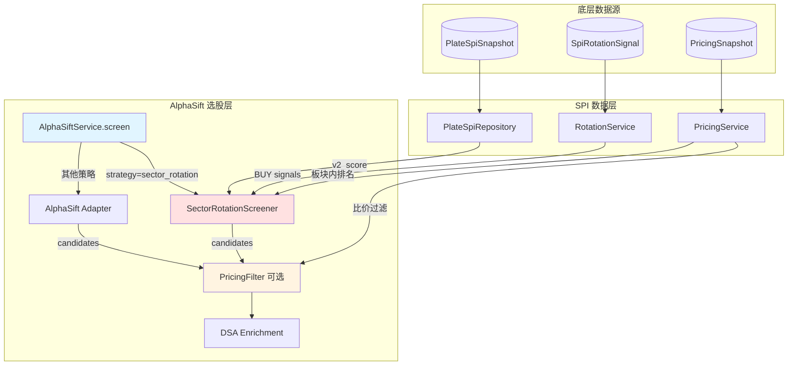
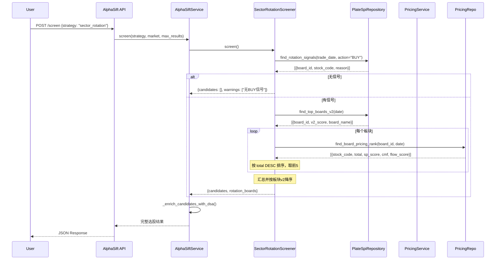
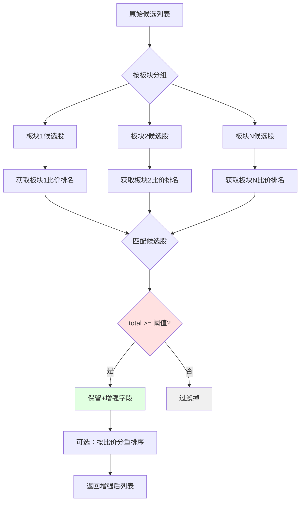
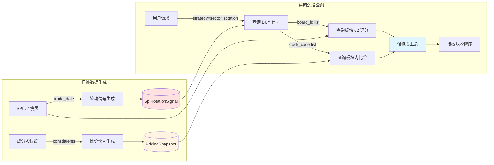
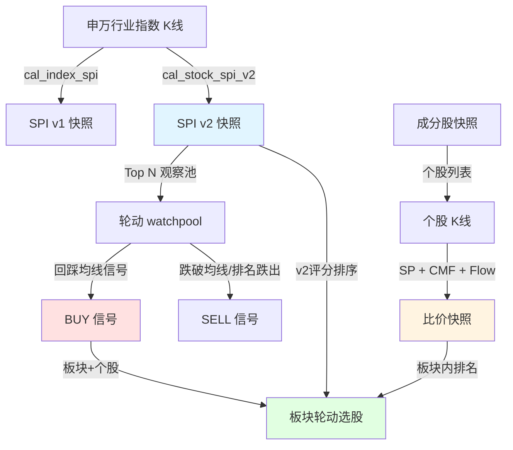
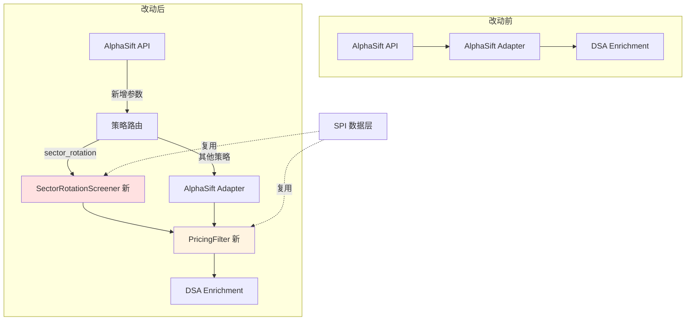
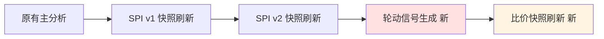

# AlphaSift 板块轮动集成方案

> **版本**: v1.1  
> **日期**: 2026-07-04  
> **依赖**: SPI 阶段1（板块 SPI v1/v2）、阶段2（轮动闭环）、阶段3（比价系统）
> 
> **实现状态**：
> - ✅ **SPI 数据层**：v1/v2 快照、轮动信号、比价快照已完成
> - ✅ **日终任务链**：v1 → v2 → rotation → pricing 顺序已落地
> - ✅ **AlphaSift 集成层**：`sector_rotation` 路由、`pricing_filter` 后处理器已落地
> 
> **注**：当前文档已对齐仓库内实现，字段契约与验收路径以下文“实际字段映射”和“验收标准”为准。

---

## 1. 方案概述

### 1.1 集成目标

将 SPI 板块轮动系统集成到 AlphaSift 选股框架，提供两种使用模式：

| 模式 | 说明 | 优先级 |
|------|------|--------|
| **独立策略** | `sector_rotation` 作为新增选股策略，基于轮动信号直接选股 | P0 |
| **增强过滤器** | `pricing_filter` 作为后处理器，叠加到现有策略 | P1 |

### 1.2 核心价值

- **板块轮动选股**：自动捕捉板块强弱切换机会，选出进入 BUY 信号的板块内个股
- **比价增强**：在板块内按 **SP（市值盈利比价）+ CMF + 资金流** 排序，优选估值合理+资金流入的强势股
- **零重复开发**：完全复用 SPI 三阶段已有能力（v2 评分、轮动信号、比价快照）

### 1.3 比价因子说明（Phase3 实际实现）

Phase3 比价系统当前使用 **SP + CMF + Flow** 三因子模型：

| 因子 | 全称 | 计算方式 | 权重 | 业务含义 |
|------|------|---------|------|---------|
| **SP** | 市值盈利比价（Size-Profit Ratio） | `sp_ratio = (个股市值/板块总市值) / (个股净利润/板块总利润)`<br>`sp_score = 1 / (1 + sp_ratio)` | 60% | 估值相对板块内高低：<br>• sp_ratio > 1：估值偏高<br>• sp_ratio < 1：估值偏低<br>• sp_score 越高越优 |
| **CMF** | Chaikin Money Flow | 量价结合的资金流向指标 [-1, 1] | 30% | 技术面资金流入/流出 |
| **Flow** | 资金流代理 | 基于 legulegu 主力资金数据 | 10%（可选） | 主力资金净流入强度 |

**历史说明**：早期设计曾考虑使用 RS（相对强弱），当前实现已切换为 SP 因子。RS 字段仍保留在比价快照中作为诊断参考，但不参与主评分计算。

---

## 2. 架构设计

### 2.1 整体架构图



### 2.2 模块职责

| 模块 | 职责 | 输入 | 输出 |
|------|------|------|------|
| **SectorRotationScreener** | 板块轮动选股主逻辑 | market, max_results, trade_date | 候选股列表（含板块信息） |
| **PricingFilter** | 板块内比价过滤器 | 原始候选列表 | 过滤+排序后候选列表 |
| **AlphaSiftService** | 策略路由 + 后处理编排 | strategy, 参数 | 统一选股结果 Schema |

---

## 3. 核心流程

### 3.1 板块轮动选股流程



### 3.2 比价过滤器流程



---

## 4. 数据流向

### 4.1 选股数据流



### 4.2 数据依赖关系



---

## 5. 改动清单

### 5.1 新增文件

| 文件路径 | 说明 | 代码量估算 |
|---------|------|-----------|
| `src/services/spi/rotation_screening.py` | 板块轮动选股器 | ~200 行 |
| `src/services/spi/pricing_filter.py` | 比价过滤器 | ~150 行 |
| `tests/test_rotation_screening.py` | 单元测试 | ~100 行 |
| `tests/test_pricing_filter.py` | 单元测试 | ~80 行 |

### 5.2 改动文件

| 文件路径 | 改动点 | 代码量估算 |
|---------|--------|-----------|
| `src/services/alphasift_service.py` | 策略路由 + 策略列表 + 后处理链 | +80 行 |
| `api/v1/endpoints/alphasift.py` | 新增查询参数 `enable_pricing_filter` | +5 行 |
| `main.py` | 日终任务增加轮动信号生成调用 | +15 行 |

### 5.3 改动架构图



---

## 6. 伪代码实现

### 6.1 板块轮动选股器

```python
class SectorRotationScreener:
    def screen(*, market, max_results, use_pricing=True, trade_date=None):
        """
        板块轮动选股主入口
        """
        trade_date = trade_date or today()
        
        # Step 1: 获取当日 BUY 信号
        buy_signals = repo.find_rotation_signals(
            trade_date=trade_date,
            action="BUY"
        )
        
        if not buy_signals:
            return {candidates: [], warnings: ["无BUY信号"]}
        
        # Step 2: 按板块分组
        board_stocks = group_by_board(buy_signals)
        
        # Step 3: 获取板块 v2 评分（用于最终排序）
        board_scores = repo.find_top_boards_v2(date=trade_date)
        
        # Step 4: 板块内选股（基于比价快照）
        candidates = []
        for board_id, stock_codes in board_stocks:
            if use_pricing:
                # 从 PricingRepository 获取板块内比价排名
                pricing_rows = pricing_repo.find_board_pricing_rank(
                    board_id=board_id,
                    trade_date=trade_date
                )
                # 按 total DESC 排序，取前5
                ranked_codes = sorted(
                    [r for r in pricing_rows if r.stock_code in stock_codes],
                    key=lambda r: r.total or 0,
                    reverse=True
                )[:5]
            else:
                ranked_codes = stock_codes[:5]
            
            for item in ranked_codes:
                candidates.append({
                    code: item.stock_code,
                    board_id: board_id,
                    board_v2_score: board_scores[board_id],
                    total: item.total,           # 比价综合分
                    sp_score: item.sp_score,     # SP 因子分
                    reason: "板块轮动BUY信号"
                })
        
        # Step 5: 按板块 v2 降序排列
        candidates.sort(key=lambda x: x.board_v2_score, reverse=True)
        
        return {
            candidates: candidates[:max_results],
            rotation_boards: len(board_stocks)
        }
```

### 6.2 比价过滤器

```python
class PricingFilter:
    def apply(candidates, *, min_total_score=0.5):
        """
        对候选股应用板块内比价过滤
        
        注意：当前实现基于 PricingRepository.find_board_pricing_rank()
        返回的字段是 total（非 total_score），且无内置 rank 字段。
        """
        # Step 1: 按板块分组
        board_groups = group_by_board(candidates)
        
        enriched = []
        for board_id, group in board_groups:
            # Step 2: 获取该板块比价快照
            pricing_rows = pricing_repo.find_board_pricing_rank(
                board_id=board_id,
                trade_date=today()
            )
            
            # 按 total DESC 排序并计算排名
            sorted_rows = sorted(
                pricing_rows,
                key=lambda r: r.total or 0,
                reverse=True
            )
            pricing_map = {
                r.stock_code: {
                    "total": r.total,
                    "rank": idx + 1,
                    "sp_ratio": r.sp_ratio,
                    "sp_score": r.sp_score,
                    "cmf": r.cmf,
                    "flow_score": r.flow_score,
                    "status": r.status,
                }
                for idx, r in enumerate(sorted_rows)
            }
            
            # Step 3: 匹配并过滤
            for candidate in group:
                pricing = pricing_map.get(candidate.code)
                
                if pricing:
                    candidate.total = pricing["total"]
                    candidate.pricing_rank = pricing["rank"]
                    candidate.sp_ratio = pricing["sp_ratio"]
                    candidate.sp_score = pricing["sp_score"]
                    candidate.cmf = pricing["cmf"]
                    candidate.flow_score = pricing["flow_score"]
                    
                    # 过滤低分股
                    if pricing["total"] and pricing["total"] < min_total_score:
                        continue
                
                enriched.append(candidate)
        
        # Step 4: 可选重排序
        enriched.sort(key=lambda x: x.total or 0, reverse=True)
        
        return enriched
```

### 6.3 策略路由（AlphaSiftService）

```python
class AlphaSiftService:
    def screen(*, strategy, market, max_results, enable_pricing_filter=False):
        """
        统一选股入口，支持策略路由
        """
        # 新增：板块轮动策略路由
        if strategy == "sector_rotation":
            screener = SectorRotationScreener()
            result = screener.screen(
                market=market,
                max_results=max_results,
                use_pricing=True
            )
            candidates = result.get("candidates", [])
        else:
            # 原有 AlphaSift 适配层逻辑
            adapter = get_dsa_adapter()
            raw = adapter.screen(strategy, market, max_results)
            candidates = normalize_candidates(raw)
        
        # 新增：可选比价过滤（对具备 board_id/code 的候选股生效）
        if enable_pricing_filter:
            pricing_filter = PricingFilter()
            candidates = pricing_filter.apply(
                candidates,
                min_total_score=0.5
            )
        
        # 复用现有 DSA enrichment
        candidates = enrich_candidates_with_dsa(candidates)
        
        return {
            enabled: True,
            candidates: candidates[:max_results],
            strategy: strategy,
            pricing_filter_enabled: enable_pricing_filter
        }
```

---

## 7. API 接口

### 7.1 板块轮动选股

**请求**

```http
POST /api/v1/alphasift/screen
Content-Type: application/json

{
  "strategy": "sector_rotation",
  "market": "cn",
  "max_results": 20
}
```

**响应示例**

```json
{
  "enabled": true,
  "strategy": "sector_rotation",
  "market": "cn",
  "candidates": [
    {
      "code": "600519",
      "board_id": 801010,
      "board_name": "食品饮料",
      "board_v2_score": 85.3,
      "total": 0.78,
      "pricing_rank": 1,
      "sp_ratio": 0.85,
      "sp_score": 0.54,
      "cmf": 0.15,
      "flow_score": 0.65,
      "status": "ok",
      "factor_mask": "sp,cmf,flow",
      "selection_reason": "板块轮动 BUY 信号（板块 SPI v2=85.30）"
    }
  ],
  "candidate_count": 20,
  "rotation_boards": 5,
  "trade_date": "2026-07-04"
}
```

### 7.2 现有策略 + 比价过滤

**请求**

```http
POST /api/v1/alphasift/screen
Content-Type: application/json

{
  "strategy": "momentum",
  "market": "cn",
  "max_results": 20,
  "enable_pricing_filter": true
}
```

**响应字段变更**

- 候选股增加 `total` / `pricing_rank` / `sp_ratio` / `sp_score` / `cmf` / `flow_score` 字段
- 响应增加 `pricing_filter_enabled: true`

### 7.3 字段契约映射（实际实现 vs 集成文档）

| 实际字段（PricingSnapshot） | 类型 | 说明 | 是否进主评分 |
|---------------------------|------|------|------------|
| `total` | Float [0,1] \| null | 比价综合分（SP+CMF+Flow 加权） | ✅ 主排序字段 |
| `sp_ratio` | Float \| null | 市值盈利比价原始值 | 转换为 sp_score |
| `sp_score` | Float [0,1] \| null | SP 归一化分（权重 60%） | ✅ 主因子 |
| `cmf` | Float [-1,1] \| null | CMF 原始值（未归一化） | 归一化后进评分 |
| `flow_score` | Float [0,1] \| null | 资金流分（权重 10%，可选） | ✅ 辅助因子 |
| `rs_score` | Float [0,1] \| null | 相对强弱（保留诊断，不进评分） | ❌ 仅诊断 |
| `status` | String | `ok` / `degraded` / `missing_core_factor` | - |
| `factor_mask` | String | 参与计算的因子，如 `sp,cmf,flow` | - |

> **注**：当前 API 返回的板块内个股**不包含 `rank` 字段**，需调用方按 `total DESC` 自行计算排名。`pricing_rank` 在集成层（SectorRotationScreener / PricingFilter）内部生成。

### 7.4 比价查询接口（已实现）

板块内比价排名可通过以下接口直接查询（Phase3 已落地）：

```http
GET /api/v1/plate-pricing/board/{board_id}/pricing?trade_date=2026-07-04
```

返回 `items` 数组，每项包含上述 `stock_code / total / rs_score / sp_ratio / sp_score / cmf / flow_score / status / factor_mask` 字段。

---

## 8. 日终任务集成

### 8.1 任务链扩展



### 8.2 main.py 伪代码

```python
async def scheduled_task():
    # 原有主分析链
    # ...
    
    # SPI v1/v2 快照刷新（已有）
    spi_service.refresh_all(trade_date=today)
    spi_service.refresh_all_v2(trade_date=today)
    
    # 新增：轮动信号生成（依赖 v2 快照）
    try:
        rotation_service = RotationService()
        signal_stats = rotation_service.generate_signals(trade_date=today)
        logger.info(f"轮动信号: {signal_stats}")
    except Exception as exc:
        logger.error("轮动信号失败", exc_info=True)
    
    # 新增：比价快照刷新（依赖成分股快照）
    try:
        pricing_service = PricingService()
        pricing_service.refresh_daily(trade_date=today)
        logger.info("比价快照完成")
    except Exception as exc:
        logger.error("比价快照失败", exc_info=True)
```

---

## 9. 数据依赖与校验

### 9.1 前置条件检查矩阵

| 能力 | 依赖数据 | 缺失时行为 |
|------|---------|-----------|
| **板块轮动选股** | SPI v2 快照 + 轮动信号表 | 返回空列表 + warning |
| **比价过滤** | 比价快照表 | 跳过过滤，返回原列表 |
| **板块内排序（当日）** | 成分股快照 + 比价快照 | 实时抓取 legulegu current snapshot（仅当日允许） |
| **板块内排序（历史）** | 成分股快照 + 比价快照 | 返回空（禁止 fallback，保护 point-in-time 语义） |

### 9.2 数据就绪检查流程

```python
def screen(*, strategy, market, max_results):
    if strategy == "sector_rotation":
        # 检查 v2 数据是否就绪
        v2_boards = repo.find_top_boards_v2(date=today, top_n=1)
        if not v2_boards:
            return {
                candidates: [],
                warnings: ["SPI v2 数据尚未就绪"]
            }
        
        # 检查轮动信号是否存在
        signals = repo.find_rotation_signals(date=today, action="BUY")
        if not signals:
            return {
                candidates: [],
                warnings: ["当日无板块轮动 BUY 信号"]
            }
    
    # 正常选股逻辑
    # ...
```

---

## 10. 验收标准

### 10.1 功能验收

- [ ] `GET /api/v1/alphasift/strategies` 返回包含 `sector_rotation` 策略
- [ ] `POST /api/v1/alphasift/screen` with `strategy=sector_rotation` 返回基于轮动信号的候选股
- [ ] 候选股按板块 v2 评分降序排列
- [ ] 启用 `enable_pricing_filter=true` 时，候选股经板块内比价过滤
- [ ] 无数据时返回友好提示（非 500 错误）

### 10.2 数据验收

```bash
# 1. 检查 SPI v2 数据
sqlite3 data/stock_analysis.db "SELECT COUNT(*) FROM plate_spi_snapshot WHERE v2_score IS NOT NULL;"

# 2. 检查轮动信号
sqlite3 data/stock_analysis.db "SELECT COUNT(*) FROM spi_rotation_signal WHERE action='BUY' AND trade_date=date('now');"

# 3. 检查比价快照
sqlite3 data/stock_analysis.db "SELECT COUNT(*) FROM pricing_snapshot WHERE trade_date=date('now');"
```

### 10.3 API 验收

```bash
# 1. 策略列表
curl http://localhost:8000/api/v1/alphasift/strategies | jq '.[] | select(.id=="sector_rotation")'

# 2. 板块轮动选股
curl -X POST http://localhost:8000/api/v1/alphasift/screen \
  -H "Content-Type: application/json" \
  -d '{"strategy":"sector_rotation","market":"cn","max_results":20}' \
  | jq '.candidates | length'

# 3. 比价过滤
curl -X POST http://localhost:8000/api/v1/alphasift/screen \
  -H "Content-Type: application/json" \
  -d '{"strategy":"momentum","market":"cn","max_results":20,"enable_pricing_filter":true}' \
  | jq '.pricing_filter_enabled'
```

---

## 11. 风险与降级

### 11.1 降级策略

| 风险场景 | 降级方案 | 用户体验 |
|---------|---------|---------|
| 轮动信号缺失 | 返回空列表 + warning | 友好提示"当日无BUY信号" |
| 比价数据缺失 | 跳过比价排序 | 返回原候选列表，不影响其他策略 |
| 成分股快照缺失（当日） | 实时抓取 legulegu current snapshot | 当日可用，无历史语义污染 |
| 成分股快照缺失（历史） | 返回空 + warning | 保护 point-in-time 语义，禁止 fallback |
| SPI v2 未就绪 | 返回空列表 + warning | 友好提示"数据尚未就绪，请稍后重试" |

### 11.2 异常隔离

```python
# 日终任务：轮动信号和比价刷新失败不影响主分析链
try:
    rotation_service.generate_signals()
except Exception:
    logger.error("轮动信号失败，跳过")
    # 主分析链继续

try:
    pricing_service.refresh_daily()
except Exception:
    logger.error("比价刷新失败，跳过")
    # 主分析链继续
```

---

## 12. 监控指标

### 12.1 业务指标

| 指标 | 说明 | 阈值 |
|------|------|------|
| `rotation_buy_signals_count` | 每日 BUY 信号数量 | > 0 |
| `rotation_sell_signals_count` | 每日 SELL 信号数量 | - |
| `sector_rotation_api_calls` | 板块轮动策略调用次数 | - |
| `pricing_filter_usage_rate` | 比价过滤启用率 | - |

### 12.2 数据质量指标

| 指标 | 说明 | 阈值 |
|------|------|------|
| `spi_v2_coverage` | v2 快照覆盖板块数 | ≥ 28/31 |
| `pricing_snapshot_coverage` | 比价快照覆盖成分股比例 | ≥ 80% |
| `constituent_snapshot_lag` | 成分股快照延迟天数 | ≤ 1 |

---

## 13. 后续演进

### 13.1 P1 增强（可选）

- **多板块组合优化**：跨板块分散度检查，避免单板块过度集中
- **轮动时机优化**：结合市场情绪指标（如恐慌指数）调整入场阈值
- **比价权重动态调整**：根据市场风格（价值/成长）动态调整 SP/CMF/Flow 权重

### 13.2 长期规划

- **回测验证**：板块轮动策略历史收益与夏普比率评估
- **信号强度分级**：BUY 信号按确定性分 A/B/C 级，优先推荐 A 级
- **前端可视化**：板块轮动热力图 + 比价雷达图

---

## 附录：关键决策记录

| # | 决策 | 依据 |
|---|------|------|
| D1 | 板块轮动作为独立策略而非嵌入现有策略 | 轮动逻辑完整独立，避免侵入现有策略复杂度 |
| D2 | 比价过滤作为可选后处理器 | 保持向后兼容，用户可按需启用 |
| D3 | 每板块最多取前5只 | 控制输出规模，避免单板块过度集中 |
| D4 | 按板块 v2 评分降序排列最终候选 | 优先推荐强势板块内个股 |
| D5 | 数据缺失时返回友好提示而非报错 | 提升用户体验，避免阻断其他功能 |

---

**文档维护**：本文档随代码实现同步更新，最终以实际代码为准。
